# Generation Z 11th Edition Website - Product Requirements Document

## Document Information
| Field | Value |
|-------|-------|
| **Version** | 1.0 |
| **Last Updated** | January 2026 |
| **Status** | Design Phase |
| **Project** | Generation Z 11th Edition (2026) - Zain |

---

## 1. Executive Summary

### 1.1 Project Overview
The Generation Z 11th Edition website is a digital showcase platform for Zain's flagship youth leadership development program. This website will present the 2026 cohort, their training programs, projects, experiences, and team members in an engaging, modern, and visually rich manner.

### 1.2 Project Goals
- **Primary Goal**: Create a polished, professional website that showcases the 11th Edition Gen Z program achievements
- **Secondary Goals**:
  - Maintain visual consistency with previous editions while introducing fresh design elements
  - Provide an immersive user experience with modern animations and interactions
  - Enable easy navigation between program sections
  - Support future scalability for upcoming editions

### 1.3 Target Audience
| Audience | Description |
|----------|-------------|
| **Zain Leadership** | Executives and managers reviewing program outcomes |
| **Current Gen Z Cohort** | Team members showcasing their work |
| **Future Applicants** | Potential candidates exploring the program |
| **External Partners** | Training partners, speakers, and collaborators |
| **General Public** | Corporate visitors and stakeholders |

---

## 2. Site Architecture

### 2.1 Navigation Structure


### 2.2 Complete Sitemap


---

## 3. Design System

### 3.1 Color Palette

#### Primary Colors
```
┌─────────────────────────────────────────────────────────────────┐
│  BRAND COLOR PALETTE                                            │
├─────────────────────────────────────────────────────────────────┤
│                                                                 │
│  ┌──────────┐  ┌──────────┐  ┌──────────┐  ┌──────────┐        │
│  │ SAPPHIRE │  │   LIME   │  │TURQUOISE │  │  PURPLE  │        │
│  │ #1E1A5F  │  │ #C3D534  │  │ #00B5AD  │  │ #9B4F96  │        │
│  │ Primary  │  │ Accent   │  │ Accent 2 │  │ Accent 3 │        │
│  └──────────┘  └──────────┘  └──────────┘  └──────────┘        │
│                                                                 │
│  ┌──────────┐  ┌──────────┐  ┌──────────┐  ┌──────────┐        │
│  │  GOLD    │  │ NAVY BG  │  │  CYAN    │  │ DEEP BLUE│        │
│  │ #F6EB69  │  │ #1C2951  │  │ #00BCD4  │  │ #3B5998  │        │
│  │ Highlight│  │Background│  │ Links    │  │ Cards    │        │
│  └──────────┘  └──────────┘  └──────────┘  └──────────┘        │
│                                                                 │
└─────────────────────────────────────────────────────────────────┘
```

#### Color Usage Guidelines

| Color | Hex Code | Usage |
|-------|----------|-------|
| **Sapphire** | `#1E1A5F` | Primary brand color, headings |
| **Navy Blue** | `#1C2951` | Hero backgrounds, gradients |
| **Lime/Yellow** | `#C3D534` / `#F6EB69` | Accent text, CTAs, highlights |
| **Turquoise** | `#00B5AD` | Secondary accents, links |
| **Card Blue** | `#3B5998` | Card backgrounds, pillars |
| **White** | `#FFFFFF` | Body text on dark, card text |
| **Light Gray** | `#F5F5F5` | Section backgrounds |

### 3.2 Typography


#### Font Stack
```css
/* Primary Heading Font */
font-family: 'Playfair Display', Georgia, serif;

/* Body & UI Font */
font-family: 'Inter', -apple-system, BlinkMacSystemFont, sans-serif;

/* Alternative Heading */
font-family: 'Poppins', sans-serif;
```

### 3.3 Spacing System

```
┌─────────────────────────────────────────────────────────────────┐
│  SPACING SCALE (Base: 4px)                                      │
├─────────────────────────────────────────────────────────────────┤
│                                                                 │
│  xs:   4px   (0.25rem)  - Tight spacing, icons                 │
│  sm:   8px   (0.5rem)   - Component padding                    │
│  md:  16px   (1rem)     - Default spacing                      │
│  lg:  24px   (1.5rem)   - Section padding                      │
│  xl:  32px   (2rem)     - Large gaps                           │
│  2xl: 48px   (3rem)     - Section margins                      │
│  3xl: 64px   (4rem)     - Hero padding                         │
│  4xl: 96px   (6rem)     - Page sections                        │
│                                                                 │
└─────────────────────────────────────────────────────────────────┘
```

### 3.4 Border Radius

| Token | Value | Usage |
|-------|-------|-------|
| `sm` | 4px | Buttons, small elements |
| `md` | 8px | Input fields |
| `lg` | 16px | Cards |
| `xl` | 24px | Feature cards |
| `2xl` | 32px | Large cards, modals |
| `full` | 9999px | Circular elements, avatars |

---

## 4. Component Library

### 4.1 Component Hierarchy


### 4.2 Card Component Specifications

#### Pillar/Target Card
```
┌─────────────────────────────────────────────────────────────────┐
│  PILLAR/TARGET CARD                                             │
├─────────────────────────────────────────────────────────────────┤
│                                                                 │
│  ┌─────────────────────────────────────────────────────────┐   │
│  │                    ┌─────────┐                          │   │
│  │                    │  ICON   │                          │   │
│  │                    │  (40px) │                          │   │
│  │                    └─────────┘                          │   │
│  │                                                         │   │
│  │              Title (Yellow/Lime)                        │   │
│  │                  20px Bold                              │   │
│  │                                                         │   │
│  │     Description text goes here with multiple            │   │
│  │     lines of content explaining the pillar              │   │
│  │     or target details. 14-16px regular.                 │   │
│  │                                                         │   │
│  └─────────────────────────────────────────────────────────┘   │
│                                                                 │
│  Background: #3B5998 (Card Blue)                               │
│  Border Radius: 16-24px                                        │
│  Padding: 32px                                                 │
│  Text: White, Yellow accents                                   │
│  Icon: White with subtle glow                                  │
│                                                                 │
└─────────────────────────────────────────────────────────────────┘
```

#### Team Member Card
```
┌─────────────────────────────────────────────────────────────────┐
│  TEAM MEMBER CARD                                               │
├─────────────────────────────────────────────────────────────────┤
│                                                                 │
│  ┌─────────────────────────────────────────────────────────┐   │
│  │                                                         │   │
│  │                    ┌───────────┐                        │   │
│  │                    │           │                        │   │
│  │                    │   PHOTO   │                        │   │
│  │                    │  (Circle) │                        │   │
│  │                    │   150px   │                        │   │
│  │                    └───────────┘                        │   │
│  │                                                         │   │
│  │                    Member Name                          │   │
│  │                    24px Bold                            │   │
│  │                                                         │   │
│  │                    Role Title                           │   │
│  │                 (Turquoise, 16px)                       │   │
│  │                                                         │   │
│  │                 Bachelor of XYZ                         │   │
│  │                 (Gray, 14px)                            │   │
│  │                                                         │   │
│  │               ┌─────┐ ┌─────┐                          │   │
│  │               │ Li  │ │ 𝕏  │                           │   │
│  │               └─────┘ └─────┘                          │   │
│  │                                                         │   │
│  └─────────────────────────────────────────────────────────┘   │
│                                                                 │
│  Background: White or Glass effect                             │
│  Border Radius: 24px                                           │
│  Shadow: Soft drop shadow                                      │
│  Hover: Slight lift + shadow increase                          │
│                                                                 │
└─────────────────────────────────────────────────────────────────┘
```

---

## 5. Page Layouts

### 5.1 Landing Page Structure

```mermaid
flowchart TB
    subgraph Hero["HERO SECTION (100vh)"]
        direction LR
        HeroLeft["Left Column<br/>─────────────<br/>Welcome to<br/>THE 11TH EDITION OF<br/>GENERATION Z<br/>by Zain<br/><br/>Description text..."]
        HeroRight["Right Column<br/>─────────────<br/>Team Photo<br/>(Group image with<br/>animated particles<br/>behind)"]
    end
    
    subgraph About["ABOUT SECTION"]
        AboutTitle["About the Gen Z Program"]
        AboutDesc["Program description paragraph<br/>with history and mission"]
    end
    
    subgraph Pillars["PROGRAM PILLARS (2-col grid)"]
        P1["🔆 Digital Innovation"]
        P2["👥 Customer Centricity"]
        P3["📋 Agile Delivery"]
        P4["🎯 Leadership"]
    end
    
    subgraph Targets["PROGRAM TARGETS (2x2 grid)"]
        T1["👥 Senior Leadership<br/>Collaboration"]
        T2["🛠️ Real Product<br/>Development"]
        T3["📚 Intensive<br/>Training"]
        T4["🏆 Executive<br/>Mentorship"]
    end
    
    subgraph GallerySection["GALLERY SECTION"]
        GalleryCarousel["← Photo 1 | Photo 2 | Photo 3 →<br/>○ ○ ● ○ ○ ○"]
    end
    
    subgraph FooterSection["FOOTER"]
        FooterContent["Social Links | Copyright © 2026 Zain"]
    end
    
    Hero --> About
    About --> Pillars
    Pillars --> Targets
    Targets --> GallerySection
    GallerySection --> FooterSection
```



### 5.2 Hero Section Layout (Desktop)

```
┌─────────────────────────────────────────────────────────────────────────────┐
│  NAVBAR                                                                      │
│  ┌─────────┐                     Home | Meet the Team | Explore | Exp       │
│  │ GEN Z   │                                                                 │
│  │  LOGO   │                                                                 │
│  └─────────┘                                                                 │
├─────────────────────────────────────────────────────────────────────────────┤
│                                                                              │
│                    ✦ ·  ✦   ·  ✦                                            │
│               · ✦     PARTICLES     ✦ ·                                     │
│                    ✦ ·  ✦   ·  ✦                                            │
│                                                                              │
│  ┌─────────────────────────────┐    ┌─────────────────────────────────┐    │
│  │                             │    │                                 │    │
│  │  Welcome to                 │    │     ┌─────────────────────┐     │    │
│  │                             │    │     │                     │     │    │
│  │  THE 11TH EDITION OF        │    │     │    TEAM PHOTO       │     │    │
│  │  GENERATION Z               │    │     │    (Group Image)    │     │    │
│  │  by Zain                    │    │     │                     │     │    │
│  │                             │    │     │    ┌──┬──┬──┬──┐    │     │    │
│  │  Over the past several      │    │     │    │  │  │  │  │    │     │    │
│  │  months, we as Generation   │    │     │    └──┴──┴──┴──┘    │     │    │
│  │  Z graduates at Zain        │    │     │                     │     │    │
│  │  Group, have gained...      │    │     └─────────────────────┘     │    │
│  │                             │    │                                 │    │
│  └─────────────────────────────┘    └─────────────────────────────────┘    │
│                                                                              │
│                              ↓ Scroll                                        │
│                                                                              │
└─────────────────────────────────────────────────────────────────────────────┘
```

### 5.3 Meet the Team Page Layout


### 5.4 Our Experiences Page Layout


---

## 6. Responsive Design

### 6.1 Breakpoints

| Breakpoint | Width | Description |
|------------|-------|-------------|
| `xs` | < 480px | Mobile portrait |
| `sm` | 480px - 768px | Mobile landscape, small tablets |
| `md` | 768px - 1024px | Tablets |
| `lg` | 1024px - 1280px | Small desktop |
| `xl` | 1280px - 1536px | Desktop |
| `2xl` | > 1536px | Large desktop |

### 6.2 Responsive Behavior


### 6.3 Mobile Hero Layout

```
┌───────────────────────────┐
│  ┌─────────────────────┐  │
│  │      GEN Z LOGO     │  │
│  │         ☰           │  │
│  └─────────────────────┘  │
├───────────────────────────┤
│                           │
│  ┌─────────────────────┐  │
│  │                     │  │
│  │     TEAM PHOTO      │  │
│  │                     │  │
│  └─────────────────────┘  │
│                           │
│     Welcome to            │
│                           │
│   THE 11TH EDITION OF     │
│    GENERATION Z           │
│       by Zain             │
│                           │
│   Description text...     │
│                           │
│         ↓                 │
│                           │
└───────────────────────────┘
```

---

## 7. Animation & Interactions

### 7.1 Animation Library

```mermaid
flowchart TB
    subgraph Libraries["Animation Libraries"]
        FM["Framer Motion<br/>─────────────<br/>• Scroll animations<br/>• Page transitions<br/>• Gesture handling"]
        
        GSAP["GSAP<br/>─────────────<br/>• Complex timelines<br/>• Text animations<br/>• ScrollTrigger"]
        
        Lenis["Lenis<br/>─────────────<br/>• Smooth scrolling<br/>• Inertia<br/>• Scroll callbacks"]
        
        Three["Three.js<br/>─────────────<br/>• Particle systems<br/>• 3D elements<br/>• WebGL effects"]
    end
```



### 7.2 Animation Specifications

#### Scroll Reveal Animations
```javascript
// Standard fade-up animation
const fadeUpVariants = {
  hidden: { 
    opacity: 0, 
    y: 30 
  },
  visible: {
    opacity: 1,
    y: 0,
    transition: {
      duration: 0.6,
      ease: [0.25, 0.46, 0.45, 0.94] // Custom easing
    }
  }
}

// Staggered children animation
const containerVariants = {
  hidden: { opacity: 0 },
  visible: {
    opacity: 1,
    transition: {
      staggerChildren: 0.1,
      delayChildren: 0.2
    }
  }
}
```

#### Particle Field Configuration
```javascript
const particleConfig = {
  count: 100,
  size: { min: 1, max: 3 },
  opacity: { min: 0.3, max: 0.8 },
  speed: 0.5,
  color: '#00B5AD', // Turquoise
  connections: {
    enabled: true,
    distance: 150,
    opacity: 0.2
  }
}
```

### 7.3 Interaction States

| Element | Default | Hover | Active | Focus |
|---------|---------|-------|--------|-------|
| **Button** | Solid bg | Lighten 10% | Scale 0.98 | Ring outline |
| **Card** | Shadow-md | Shadow-lg + translateY(-4px) | Scale 0.99 | Ring outline |
| **Link** | Text color | Underline + color shift | — | Ring outline |
| **Nav Item** | Normal | Color shift | Bold | Underline |

### 7.4 Confetti Success Animation
```javascript
// Used on form submission success
const confettiConfig = {
  particleCount: 150,
  spread: 70,
  origin: { y: 0.6 },
  colors: ['#C3D534', '#00B5AD', '#9B4F96', '#F6EB69'],
  gravity: 0.8,
  ticks: 200
}
```

---

## 8. Visual Effects

### 8.1 Background Effects

```mermaid
flowchart TB
    subgraph Gradients["Gradient Backgrounds"]
        G1["Hero Gradient<br/>Navy → Turquoise<br/>(diagonal)"]
        G2["Aurora Effect<br/>Animated color shifts<br/>Soft blends"]
    end
    
    subgraph Overlays["Overlay Effects"]
        O1["Particle Field<br/>Floating dots with<br/>connection lines"]
        O2["Noise Texture<br/>Subtle grain for<br/>depth"]
    end
    
    subgraph Glass["Glassmorphism"]
        GL1["backdrop-blur: 12px"]
        GL2["background: rgba(255,255,255,0.1)"]
        GL3["border: 1px solid rgba(255,255,255,0.2)"]
    end
```



### 8.2 Hero Background Gradient
```css
.hero-gradient {
  background: linear-gradient(
    135deg,
    #1C2951 0%,      /* Navy */
    #1E1A5F 25%,     /* Sapphire */
    #2A4365 50%,     /* Blue */
    #00B5AD 100%     /* Turquoise */
  );
}
```

### 8.3 Glassmorphism Panel
```css
.glass-panel {
  background: rgba(255, 255, 255, 0.1);
  backdrop-filter: blur(12px);
  -webkit-backdrop-filter: blur(12px);
  border: 1px solid rgba(255, 255, 255, 0.2);
  border-radius: 24px;
  box-shadow: 0 8px 32px rgba(0, 0, 0, 0.1);
}
```

---

## 9. Component Specifications

### 9.1 Navbar Component

```
┌─────────────────────────────────────────────────────────────────────────────┐
│                                                                              │
│  ┌─────────┐                                                                │
│  │ GEN Z   │        Home    Meet the Team    Explore our Work    Our Exp   │
│  │  LOGO   │                                                                │
│  └─────────┘                                                                │
│                                                                              │
└─────────────────────────────────────────────────────────────────────────────┘

Properties:
- Position: Fixed top
- Background: Transparent → Solid on scroll
- Height: 64-80px
- Logo: 48px height
- Nav items: 16px, medium weight
- Active state: Underline or color change
- Mobile: Hamburger menu with slide-out drawer
```

### 9.2 Footer Component

```
┌─────────────────────────────────────────────────────────────────────────────┐
│                                                                              │
│                           Connect with us                                    │
│                                                                              │
│                     [Li]  [𝕏]  [IG]  [📧]                                   │
│                                                                              │
│                                                                              │
│              Copyright © 2026 Zain. All Rights Reserved                     │
│                                                                              │
└─────────────────────────────────────────────────────────────────────────────┘

Properties:
- Background: Sapphire (#1E1A5F) or match page
- Padding: 48px vertical
- Social icons: 32px, hover lift effect
- Text: White, 14px
```

### 9.3 Gallery Carousel

```
┌─────────────────────────────────────────────────────────────────────────────┐
│                                                                              │
│   Gallery                                                                    │
│                                                                              │
│  ┌───────────────┐ ┌───────────────┐ ┌───────────────┐                     │
│  │               │ │               │ │               │                     │
│◀ │   Image 1     │ │   Image 2     │ │   Image 3     │ ▶                   │
│  │               │ │               │ │               │                     │
│  └───────────────┘ └───────────────┘ └───────────────┘                     │
│                                                                              │
│                          ○ ○ ● ○ ○ ○                                        │
│                                                                              │
│  ─────────────────────────────────────                                      │
│  [                    ●              ]  <- Progress bar                     │
│                                                                              │
└─────────────────────────────────────────────────────────────────────────────┘

Properties:
- Display: 3 images on desktop, 1 on mobile
- Navigation: Arrow buttons + dots + progress bar
- Aspect ratio: 16:9 or 4:3
- Transition: Smooth slide with slight overlap
- Auto-play: Optional, 5-second intervals
```

---

## 10. Implementation Notes

### 10.1 Tech Stack

| Layer | Technology |
|-------|------------|
| **Framework** | Next.js 16 (App Router) |
| **UI Library** | React 19 |
| **Styling** | Tailwind CSS v4 |
| **Components** | Radix UI + Shadcn/ui |
| **Animations** | Framer Motion, GSAP |
| **3D/WebGL** | Three.js, @react-three/fiber |
| **Smooth Scroll** | Lenis |
| **Forms** | React Hook Form + Zod |

### 10.2 File Structure

```
app/
├── page.tsx                 # Landing page
├── team/
│   └── page.tsx            # Meet the Team
├── projects/
│   └── page.tsx            # Our Projects
├── experiences/
│   └── page.tsx            # Our Experiences
└── reframe/
    └── page.tsx            # Reframe Workshop

components/
├── layout/
│   ├── navbar.tsx
│   └── footer.tsx
├── sections/
│   ├── hero.tsx
│   ├── about.tsx
│   ├── pillars.tsx
│   ├── targets.tsx
│   └── gallery.tsx
├── cards/
│   ├── pillar-card.tsx
│   ├── target-card.tsx
│   ├── team-card.tsx
│   ├── project-card.tsx
│   └── experience-card.tsx
├── effects/
│   ├── particle-field.tsx
│   ├── aurora-background.tsx
│   └── confetti.tsx
└── ui/
    └── [shadcn components]
```

### 10.3 Performance Considerations

1. **Lazy Loading**: Use dynamic imports for 3D components
2. **Image Optimization**: Next.js Image component with appropriate sizes
3. **Animation**: Use `will-change` sparingly, prefer `transform` and `opacity`
4. **Bundle Size**: Tree-shake unused components
5. **Hydration**: Mark interactive components with `'use client'`

### 10.4 Accessibility Requirements

- **Color Contrast**: Minimum 4.5:1 for body text, 3:1 for large text
- **Focus States**: Visible focus indicators on all interactive elements
- **ARIA Labels**: Proper labeling for icons and images
- **Keyboard Navigation**: Full keyboard accessibility
- **Reduced Motion**: Respect `prefers-reduced-motion` media query

---

## 11. Appendix

### 11.1 Icon Set
Use Lucide React or similar icon library for consistent iconography:
- `Lightbulb` - Digital Innovation
- `Users` - Customer Centricity / Team
- `Target` - Goals / Targets
- `Award` - Achievement / Mentorship
- `BookOpen` - Training / Learning
- `Briefcase` - Projects / Work
- `Calendar` - Events / Timeline
- `MapPin` - Location
- `ExternalLink` - External links
- `ChevronLeft/Right` - Navigation

### 11.2 Image Assets Required

| Asset | Dimensions | Format | Usage |
|-------|------------|--------|-------|
| Team Group Photo | 1200x800 | WebP/JPG | Hero section |
| Individual Portraits | 400x400 | WebP/PNG | Team cards |
| Gallery Images | 800x600 | WebP/JPG | Gallery carousel |
| Experience Photos | 600x400 | WebP/JPG | Experience cards |
| Gen Z Logo | 200x200 | SVG/PNG | Navbar, favicon |
| Zain Logo | 300x100 | SVG/PNG | Footer |

### 11.3 Content Requirements

Each page requires the following content:

**Landing Page:**
- Welcome headline and edition number
- Program description (100-200 words)
- 4 Program Pillars with descriptions
- 4 Program Targets with descriptions
- 6-10 gallery images

**Meet the Team:**
- 6 team member profiles (photo, name, role, education)
- Previous cohort summaries (2-3 sentences each)
- Social media links

**Our Projects:**
- 4-6 project cards with dates, descriptions, and images
- 2-3 initiative descriptions

**Our Experiences:**
- 3-5 experience entries with dates, locations, purposes, and key learnings
- Accompanying photos for each experience

---

*Document End*

*This PRD serves as the design foundation for the Generation Z 11th Edition website. All implementation should reference this document for consistency.*
