# Product Requirements Document (PRD)
## Generation Z Website - Combined 10th & 11th Edition

**Version:** 1.0
**Date:** January 28, 2026
**Author:** Zain Gen Z Team
**Status:** Draft

---

## Table of Contents
1. [Executive Summary](#1-executive-summary)
2. [Problem Statement](#2-problem-statement)
3. [Goals & Objectives](#3-goals--objectives)
4. [Target Audience](#4-target-audience)
5. [Technical Architecture](#5-technical-architecture)
6. [Feature Requirements](#6-feature-requirements)
7. [Design System](#7-design-system)
8. [User Flows](#8-user-flows)
9. [Visual Design Recommendations](#9-visual-design-recommendations)
10. [Implementation Roadmap](#10-implementation-roadmap)
11. [Success Metrics](#11-success-metrics)

---

## 1. Executive Summary

The Generation Z Website is a digital platform for Zain's internal Gen Z Program, designed to empower the next generation of leaders through hands-on experience in leadership, innovation, and continuous learning. This PRD combines the best elements from both the 10th Edition (built with Vite + React) and the 11th Edition (built with Next.js) to create a unified, modern web experience.

### Key Highlights
- **Program Focus:** REFRAME learning series based on transformative books
- **Current Book:** "Reset" by Dan Heath
- **Event:** Workshop sessions at ZINC Innovation Campus
- **Audience:** Zain employees participating in the Gen Z 2026 Program

---

## 2. Problem Statement

The Gen Z Program needs a cohesive digital presence that:
- Showcases the program's learning initiatives (REFRAME series)
- Enables seamless event registration for workshops
- Provides information about facilitators, agenda, and books
- Works flawlessly across all devices with modern UX standards
- Maintains Zain's brand identity while appealing to younger professionals

---

## 3. Goals & Objectives

### Primary Goals
| Goal | Description | Success Metric |
|------|-------------|----------------|
| **Engagement** | Drive workshop registrations | 80%+ registration rate |
| **Awareness** | Increase program visibility | 1000+ monthly visitors |
| **Experience** | Deliver exceptional UX | <3s load time, 90+ Lighthouse |
| **Accessibility** | WCAG 2.1 AA compliance | 100% accessibility score |

### Secondary Goals
- Establish a consistent design language for future editions
- Create reusable component library
- Enable easy content updates for program managers

---

## 4. Target Audience

### Primary Persona: Zain Employee (Gen Z Program Participant)
- **Age:** 22-35 years
- **Role:** Early to mid-career professionals at Zain
- **Tech Savvy:** High - comfortable with modern web experiences
- **Goals:** Career development, networking, continuous learning
- **Pain Points:** Limited time, needs quick access to information

### Secondary Persona: Program Manager
- **Role:** Gen Z Program coordinator
- **Goals:** Track registrations, manage content
- **Needs:** Easy content management, analytics access

---

## 5. Technical Architecture

### 5.1 High-Level System Architecture

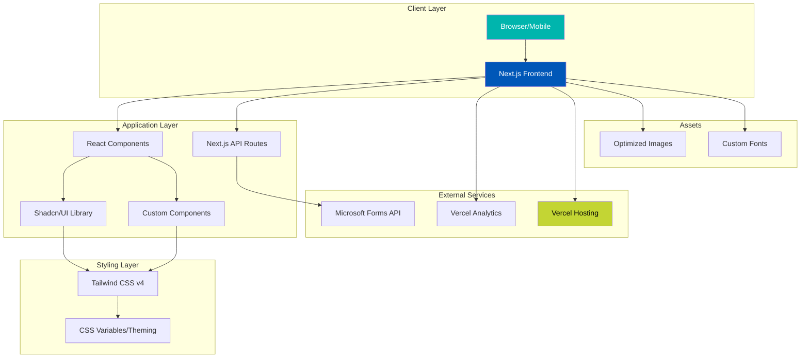

### 5.2 Component Architecture

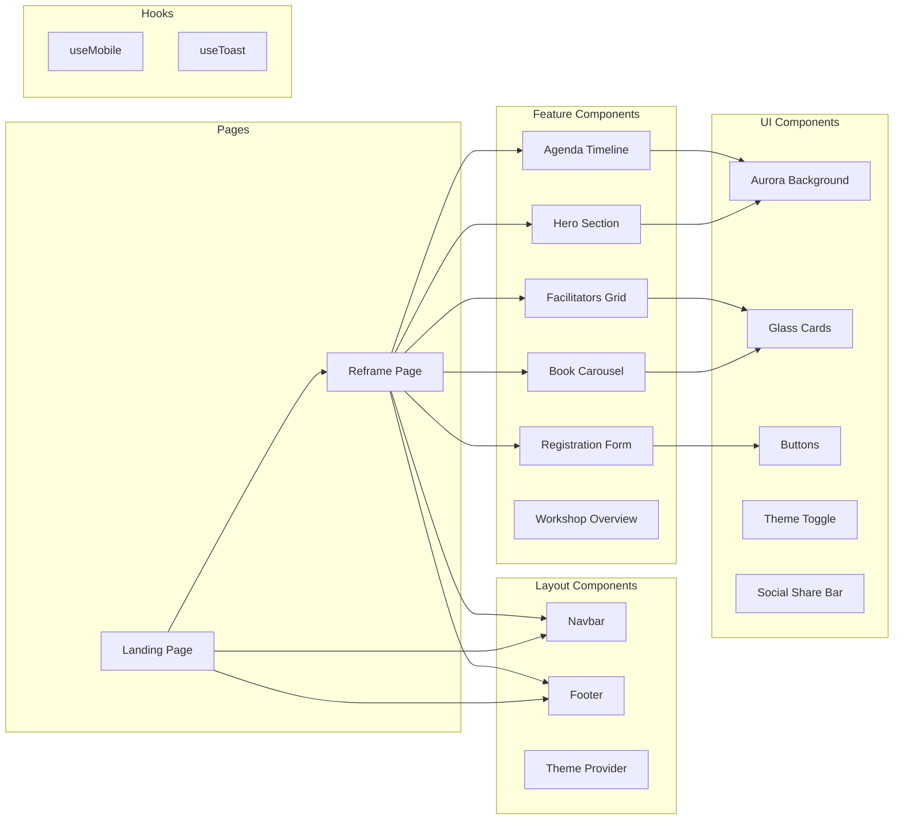

### 5.3 Data Flow Architecture

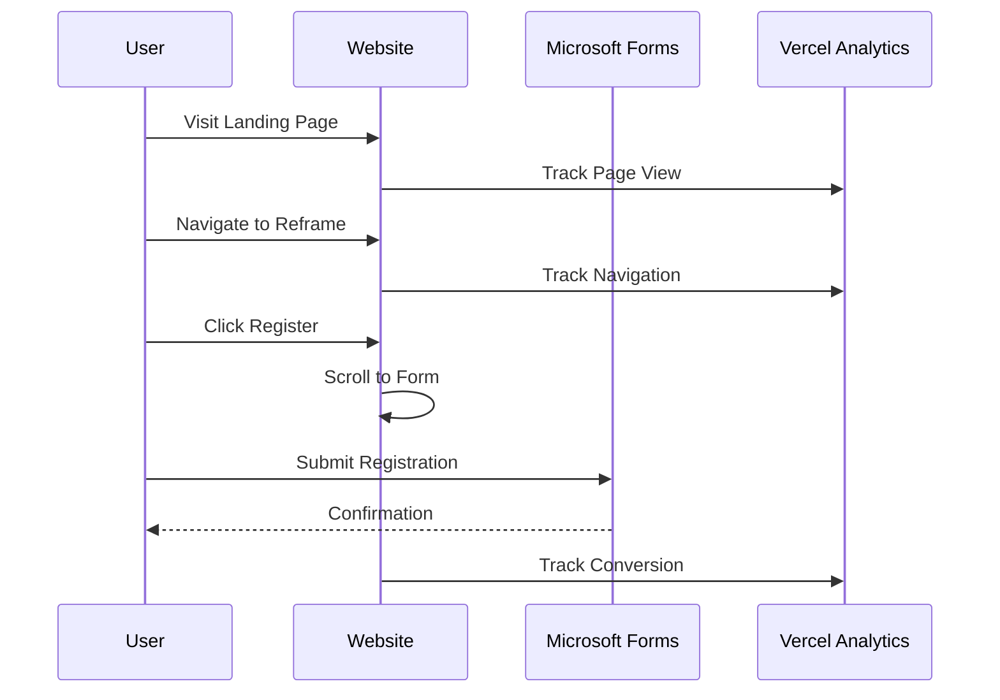

### 5.4 Technology Stack Comparison

| Aspect | 10th Edition | 11th Edition | Recommended (Combined) |
|--------|--------------|--------------|------------------------|
| Framework | Vite + React 19 | Next.js 16 | **Next.js 16** |
| Language | JavaScript/JSX | TypeScript/TSX | **TypeScript** |
| Styling | Tailwind CSS 3 | Tailwind CSS 4 | **Tailwind CSS 4** |
| UI Library | Custom + React Icons | Shadcn/UI + Radix | **Shadcn/UI + Radix** |
| 3D Graphics | Three.js + R3F | None | **Optional Enhancement** |
| Animations | GSAP + Framer Motion | CSS + Framer Motion | **Framer Motion** |
| Scrolling | Lenis + Locomotive | CSS Smooth Scroll | **Lenis** |
| Package Manager | npm | pnpm | **pnpm** |
| Deployment | Vercel | Vercel | **Vercel** |

---

## 6. Feature Requirements

### 6.1 Core Features (P0 - Must Have)

#### Landing Page (Gen Z Hub)
| Feature | Description | Status |
|---------|-------------|--------|
| Hero Section | Animated intro with program branding | 11th Edition |
| Program Cards | Links to active programs (REFRAME) | 11th Edition |
| Info Cards | Community Learning, Innovation, Expert Content | 11th Edition |
| Contact Section | Email link for inquiries | 11th Edition |

#### REFRAME Page
| Feature | Description | Status |
|---------|-------------|--------|
| Hero Section | Animated title with Aurora background | 11th Edition |
| Navigation Bar | Sticky nav with smooth scroll | 11th Edition |
| Book Carousel | Showcase current & upcoming books | 11th Edition |
| Agenda Timeline | Interactive session timeline | 11th Edition |
| Facilitators | Team grid with LinkedIn links | 11th Edition |
| Registration | Embedded Microsoft Forms | 11th Edition |
| Footer | Quick links, social, contact | 11th Edition |

### 6.2 Enhanced Features (P1 - Should Have)

| Feature | Description | Source |
|---------|-------------|--------|
| Dark/Light Theme | System preference + manual toggle | 11th Edition |
| 3D Elements | Three.js for immersive visuals | 10th Edition |
| Confetti Animation | Registration success celebration | 10th Edition |
| Smooth Scrolling | Lenis/Locomotive integration | 10th Edition |
| Series Progress | Visual progress tracker | 11th Edition |
| Floating CTA | Persistent registration button | 11th Edition |

### 6.3 Future Features (P2 - Nice to Have)

| Feature | Description | Priority |
|---------|-------------|----------|
| User Dashboard | Track personal learning journey | Medium |
| Past Events Gallery | Archive of previous sessions | Medium |
| Community Forum | Discussion space for participants | Low |
| Gamification | Badges and achievements | Low |
| Multi-language | Arabic + English support | High |

---

## 7. Design System

### 7.1 Color Palette

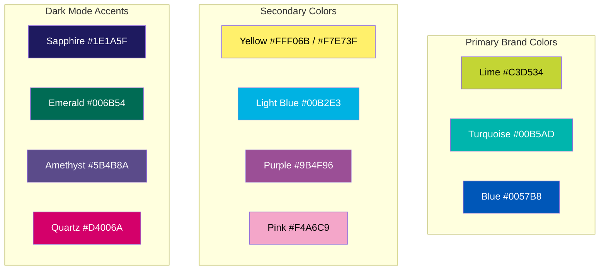

### 7.2 Typography

| Element | Font | Weight | Size (Desktop) | Size (Mobile) |
|---------|------|--------|----------------|---------------|
| H1 | Plus Jakarta Sans | 800 (Black) | 5rem / 80px | 2.5rem / 40px |
| H2 | Plus Jakarta Sans | 700 (Bold) | 3rem / 48px | 1.5rem / 24px |
| H3 | Plus Jakarta Sans | 700 (Bold) | 1.5rem / 24px | 1.125rem / 18px |
| Body | Plus Jakarta Sans | 400 (Regular) | 1rem / 16px | 0.875rem / 14px |
| Caption | Plus Jakarta Sans | 500 (Medium) | 0.875rem / 14px | 0.75rem / 12px |
| Mono | Geist Mono | 400 | 0.875rem / 14px | 0.75rem / 12px |

### 7.3 Glassmorphism Design Tokens

```css
/* Glass Card */
--glass-bg: rgba(255, 255, 255, 0.15);
--glass-blur: blur(12px);
--glass-border: 1px solid rgba(255, 255, 255, 0.2);
--glass-radius: 16px;
--glass-shadow: 0 8px 32px rgba(0, 0, 0, 0.1);

/* Glass Button */
--glass-btn-bg: rgba(255, 255, 255, 0.25);
--glass-btn-hover: rgba(255, 255, 255, 0.35);
--glass-btn-blur: blur(8px);
```

### 7.4 Animation Tokens

| Animation | Duration | Easing | Use Case |
|-----------|----------|--------|----------|
| Aurora | 20s | ease-in-out | Background movement |
| Float | 6s | ease-in-out | Decorative elements |
| Pulse Glow | 2s | ease-in-out | Active indicators |
| Bubble Float | 10-15s | ease-in-out | Background bubbles |
| Fade In | 700ms | ease-out | Content reveal |
| Hover Lift | 300ms | ease | Card interactions |

---

## 8. User Flows

### 8.1 Registration Flow

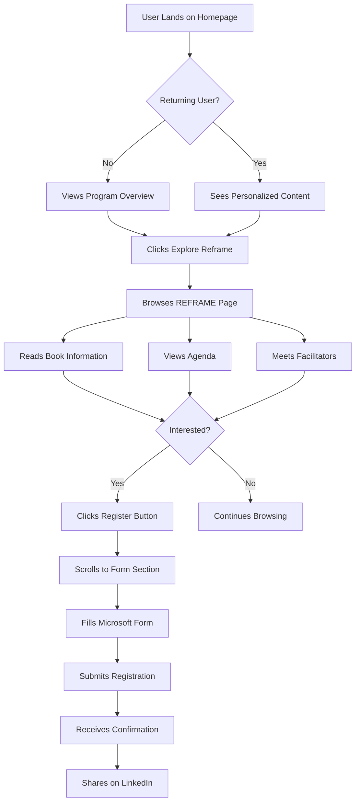

### 8.2 Navigation Flow

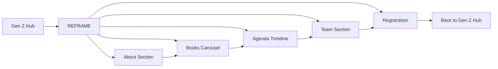

---

## 9. Visual Design Recommendations

### 9.1 Enhancements from 10th Edition to Integrate

| Feature | Description | Implementation |
|---------|-------------|----------------|
| **3D Book Covers** | Interactive 3D book visualization using Three.js | Add to Book Carousel section |
| **Particle Background** | Subtle floating particles with brand colors | Aurora Background enhancement |
| **Page Transitions** | Smooth route transitions with Framer Motion | Layout component |
| **Advanced Scroll Animations** | Parallax effects with GSAP/Lenis | All sections |
| **Confetti Celebration** | On successful registration | Registration component |
| **Slick Carousel** | Alternative carousel with touch gestures | Book Carousel |

### 9.2 New Visual Enhancements

#### Micro-interactions
- **Button Hover:** Scale + glow effect with color transition
- **Card Hover:** Lift (translateY) + enhanced shadow
- **Link Hover:** Underline animation from center
- **Form Focus:** Glow ring with brand color
- **Success State:** Confetti + checkmark animation

#### Loading States
- **Skeleton Screens:** Glass-styled placeholder animations
- **Progress Indicators:** Gradient-animated progress bars
- **Lazy Loading:** Fade-in for images and content blocks

#### Scroll Effects
- **Parallax Hero:** Background moves slower than content
- **Reveal Animations:** Elements fade/slide in on scroll
- **Progress Bar:** Reading progress indicator
- **Sticky Elements:** Navbar transparency transition

### 9.3 Accessibility Enhancements

| Area | Current | Recommended |
|------|---------|-------------|
| Focus States | Basic ring | High-contrast, visible ring |
| Color Contrast | Good | Add high-contrast mode |
| Motion | Full animations | Respect `prefers-reduced-motion` |
| Screen Readers | ARIA labels | Enhanced semantic structure |
| Keyboard Nav | Basic | Full keyboard navigation |
| Skip Links | Missing | Add skip to main content |

### 9.4 Mobile-First Improvements

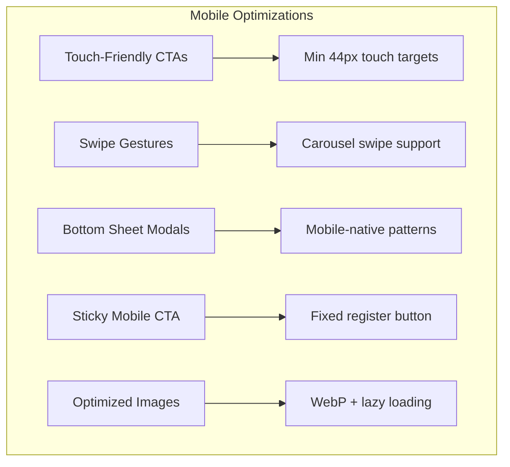

---

## 10. Implementation Roadmap

### Phase 1: Foundation (Week 1-2)
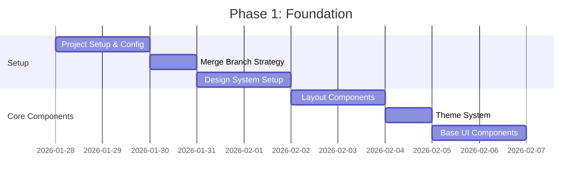

### Phase 2: Feature Development (Week 3-4)
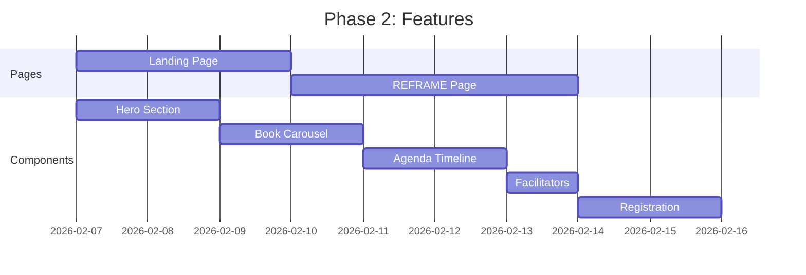

### Phase 3: Enhancement & Launch (Week 5-6)
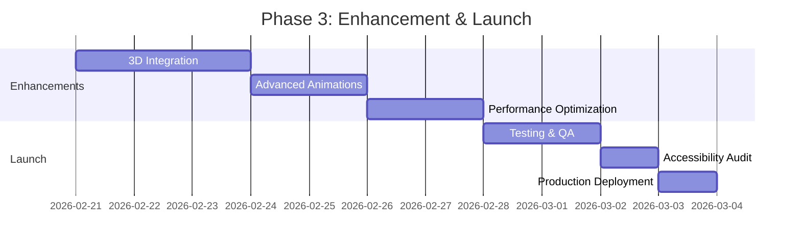

---

## 11. Success Metrics

### Key Performance Indicators (KPIs)

| Metric | Target | Measurement |
|--------|--------|-------------|
| **Lighthouse Performance** | 90+ | Google Lighthouse |
| **Core Web Vitals LCP** | <2.5s | Vercel Analytics |
| **Core Web Vitals FID** | <100ms | Vercel Analytics |
| **Core Web Vitals CLS** | <0.1 | Vercel Analytics |
| **Registration Conversion** | 25%+ | Form submissions / visits |
| **Bounce Rate** | <40% | Vercel Analytics |
| **Session Duration** | >2min | Vercel Analytics |
| **Mobile Usage** | Track % | Vercel Analytics |

### Monitoring Dashboard

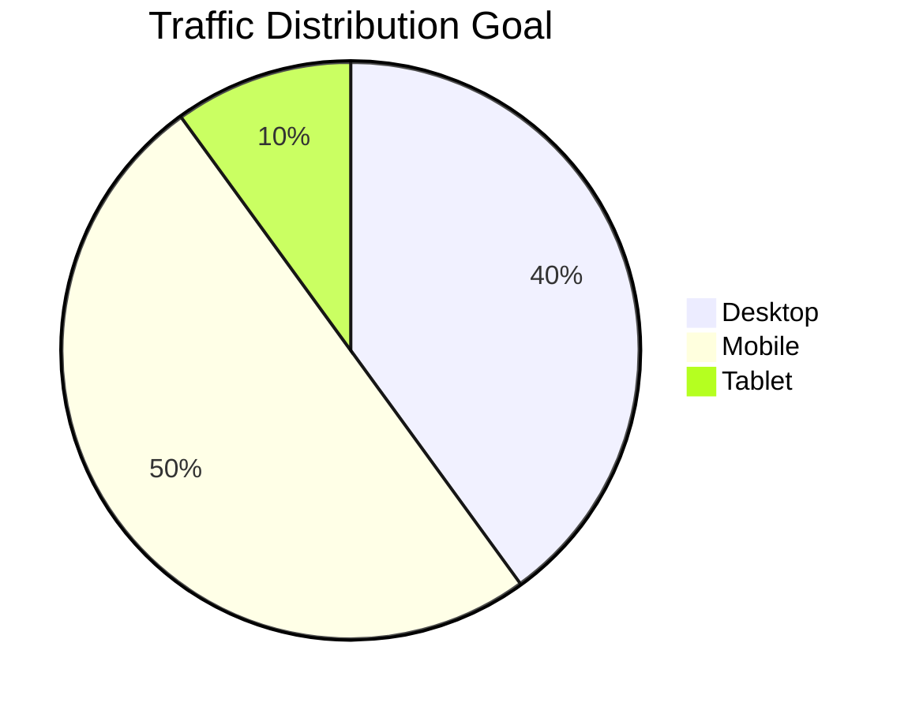

---

## Appendix

### A. File Structure (Recommended)

```
GenBeta_Web/
├── app/
│   ├── layout.tsx
│   ├── page.tsx (Landing)
│   ├── reframe/
│   │   └── page.tsx
│   └── globals.css
├── components/
│   ├── ui/ (Shadcn)
│   ├── aurora-background.tsx
│   ├── hero.tsx
│   ├── navbar.tsx
│   ├── book-carousel.tsx
│   ├── agenda-timeline.tsx
│   ├── facilitators.tsx
│   ├── registration.tsx
│   ├── footer.tsx
│   └── theme-toggle.tsx
├── hooks/
│   ├── use-mobile.ts
│   └── use-toast.ts
├── lib/
│   └── utils.ts
├── public/
│   └── images/
├── docs/
│   └── PRD.md
└── package.json
```

### B. Environment Variables

```env
# Analytics
NEXT_PUBLIC_VERCEL_ANALYTICS_ID=

# Feature Flags
NEXT_PUBLIC_ENABLE_3D=true
NEXT_PUBLIC_ENABLE_CONFETTI=true
```

### C. Dependencies (Recommended)

```json
{
  "dependencies": {
    "next": "^16.0.0",
    "react": "^19.0.0",
    "framer-motion": "^12.0.0",
    "lucide-react": "^0.454.0",
    "@radix-ui/react-*": "latest",
    "tailwind-merge": "^3.0.0",
    "class-variance-authority": "^0.7.0",
    "next-themes": "^0.4.0",
    "@vercel/analytics": "^1.3.0"
  },
  "devDependencies": {
    "typescript": "^5.0.0",
    "tailwindcss": "^4.0.0",
    "@types/react": "^19.0.0"
  },
  "optionalDependencies": {
    "@react-three/fiber": "^9.0.0",
    "@react-three/drei": "^10.0.0",
    "three": "^0.180.0",
    "gsap": "^3.13.0",
    "lenis": "^1.3.0"
  }
}
```

---

**Document History**

| Version | Date | Author | Changes |
|---------|------|--------|---------|
| 1.0 | 2026-01-28 | Gen Z Team | Initial PRD combining 10th & 11th editions |

---

*This PRD is a living document and will be updated as requirements evolve.*
