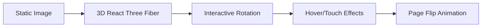
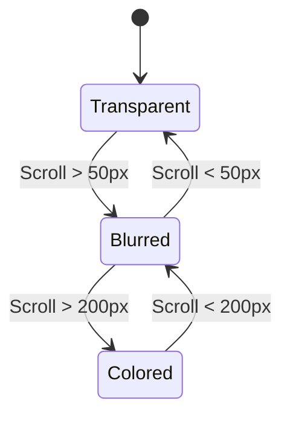
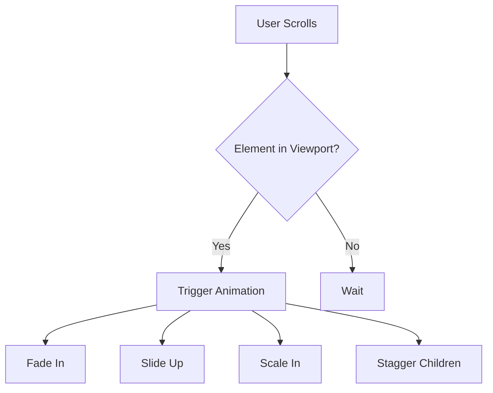
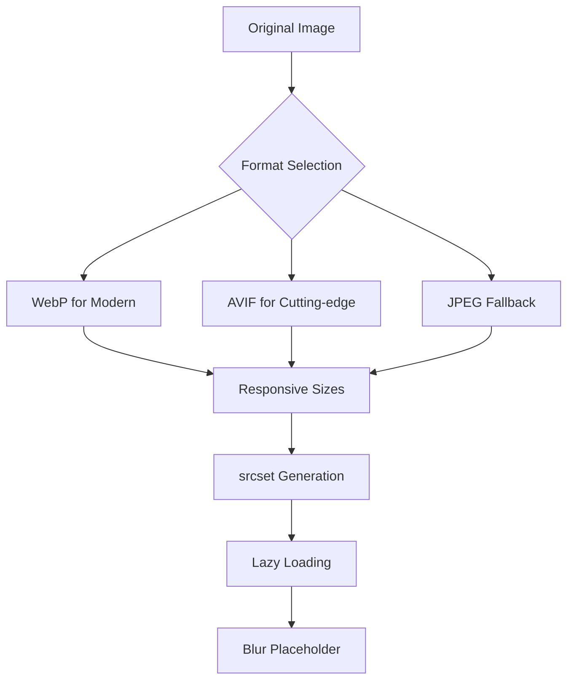

# Visual Design Recommendations
## Generation Z Website - Enhancement Guide

**Version:** 1.0
**Date:** January 28, 2026

---

## Overview

This document outlines visual design enhancements to elevate the Gen Z website experience, combining the best elements from the 10th Edition (advanced animations, 3D graphics) with the 11th Edition (modern UI components, glassmorphism) to create a truly immersive digital experience.

---

## 1. Hero Section Enhancements

### Current State
- Aurora background with gradient orbs
- Fade-in text animations
- Static feature cards

### Recommended Enhancements

#### 1.1 3D Book Cover (From 10th Edition)


**Implementation:**
```tsx
// Add 3D book visualization using @react-three/fiber
import { Canvas } from '@react-three/fiber'
import { Float, PresentationControls } from '@react-three/drei'

function Book3D() {
  return (
    <Canvas>
      <PresentationControls polar={[-0.1, 0.1]} azimuth={[-0.5, 0.5]}>
        <Float speed={1.5} rotationIntensity={0.5}>
          <mesh>
            {/* Book geometry with texture */}
          </mesh>
        </Float>
      </PresentationControls>
    </Canvas>
  )
}
```

#### 1.2 Particle System Background
Add subtle floating particles using the brand color palette:

```css
/* Particle animation enhancement */
@keyframes particle-float {
  0%, 100% {
    transform: translate(0, 0) rotate(0deg);
    opacity: 0.3;
  }
  50% {
    transform: translate(20px, -30px) rotate(180deg);
    opacity: 0.6;
  }
}

.particle {
  animation: particle-float 15s ease-in-out infinite;
  background: radial-gradient(circle, var(--lime) 0%, transparent 70%);
}
```

#### 1.3 Text Reveal Animation
Implement character-by-character or word-by-word reveal:

```tsx
// Using Framer Motion for text reveal
import { motion } from 'framer-motion'

const textReveal = {
  hidden: { opacity: 0, y: 20 },
  visible: (i: number) => ({
    opacity: 1,
    y: 0,
    transition: { delay: i * 0.05 }
  })
}

function AnimatedTitle({ text }: { text: string }) {
  return (
    <h1>
      {text.split('').map((char, i) => (
        <motion.span key={i} custom={i} variants={textReveal}>
          {char}
        </motion.span>
      ))}
    </h1>
  )
}
```

---

## 2. Navigation Enhancements

### 2.1 Smart Navigation States



**Enhanced Navbar Styles:**
```css
/* Multi-state navigation */
.navbar-transparent {
  background: transparent;
  backdrop-filter: none;
}

.navbar-blurred {
  background: rgba(255, 255, 255, 0.1);
  backdrop-filter: blur(20px);
  border-bottom: 1px solid rgba(255, 255, 255, 0.1);
}

.navbar-solid {
  background: rgba(0, 87, 184, 0.95);
  backdrop-filter: blur(20px);
  box-shadow: 0 4px 30px rgba(0, 0, 0, 0.1);
}
```

### 2.2 Active Section Indicator
Add visual feedback for current section:

```tsx
// Intersection Observer for section tracking
const [activeSection, setActiveSection] = useState('hero')

useEffect(() => {
  const observer = new IntersectionObserver(
    (entries) => {
      entries.forEach((entry) => {
        if (entry.isIntersecting) {
          setActiveSection(entry.target.id)
        }
      })
    },
    { threshold: 0.5 }
  )
  // Observe all sections
}, [])
```

---

## 3. Card & Component Enhancements

### 3.1 Glassmorphism 2.0 (Enhanced)

**Current Glass Effect:**
```css
.glass-card {
  background: rgba(255, 255, 255, 0.15);
  backdrop-filter: blur(12px);
  border: 1px solid rgba(255, 255, 255, 0.2);
}
```

**Enhanced Glass Effect:**
```css
.glass-card-enhanced {
  /* Multi-layer glass effect */
  background:
    linear-gradient(
      135deg,
      rgba(255, 255, 255, 0.1) 0%,
      rgba(255, 255, 255, 0.05) 100%
    );
  backdrop-filter: blur(20px) saturate(180%);
  -webkit-backdrop-filter: blur(20px) saturate(180%);
  border: 1px solid rgba(255, 255, 255, 0.18);
  box-shadow:
    0 8px 32px rgba(0, 0, 0, 0.1),
    inset 0 0 0 1px rgba(255, 255, 255, 0.05);

  /* Subtle inner glow */
  &::before {
    content: '';
    position: absolute;
    inset: 0;
    border-radius: inherit;
    padding: 1px;
    background: linear-gradient(
      135deg,
      rgba(195, 213, 52, 0.2) 0%,
      transparent 50%,
      rgba(0, 181, 173, 0.2) 100%
    );
    -webkit-mask:
      linear-gradient(#fff 0 0) content-box,
      linear-gradient(#fff 0 0);
    mask:
      linear-gradient(#fff 0 0) content-box,
      linear-gradient(#fff 0 0);
    -webkit-mask-composite: xor;
    mask-composite: exclude;
    pointer-events: none;
  }
}
```

### 3.2 Interactive Card Hover States

```css
.card-interactive {
  transition: all 0.4s cubic-bezier(0.175, 0.885, 0.32, 1.275);

  &:hover {
    transform: translateY(-8px) scale(1.02);
    box-shadow:
      0 20px 40px rgba(0, 0, 0, 0.15),
      0 0 0 1px rgba(195, 213, 52, 0.3);

    /* Glow effect */
    &::after {
      content: '';
      position: absolute;
      inset: -2px;
      border-radius: inherit;
      background: linear-gradient(
        135deg,
        var(--lime),
        var(--turquoise)
      );
      filter: blur(20px);
      opacity: 0.3;
      z-index: -1;
    }
  }
}
```

---

## 4. Animation Enhancements

### 4.1 Scroll-Triggered Animations



**Implementation with Framer Motion:**
```tsx
const scrollVariants = {
  hidden: {
    opacity: 0,
    y: 60,
    scale: 0.95
  },
  visible: {
    opacity: 1,
    y: 0,
    scale: 1,
    transition: {
      duration: 0.6,
      ease: [0.22, 1, 0.36, 1], // Custom easing
      staggerChildren: 0.1
    }
  }
}

function AnimatedSection({ children }) {
  return (
    <motion.div
      initial="hidden"
      whileInView="visible"
      viewport={{ once: true, amount: 0.3 }}
      variants={scrollVariants}
    >
      {children}
    </motion.div>
  )
}
```

### 4.2 Smooth Scroll with Lenis (From 10th Edition)

```tsx
// Install: npm install lenis
import Lenis from 'lenis'

useEffect(() => {
  const lenis = new Lenis({
    duration: 1.2,
    easing: (t) => Math.min(1, 1.001 - Math.pow(2, -10 * t)),
    orientation: 'vertical',
    smoothWheel: true,
  })

  function raf(time: number) {
    lenis.raf(time)
    requestAnimationFrame(raf)
  }
  requestAnimationFrame(raf)

  return () => lenis.destroy()
}, [])
```

### 4.3 Parallax Effects

```tsx
// Parallax scrolling for background elements
const { scrollYProgress } = useScroll()
const y = useTransform(scrollYProgress, [0, 1], ['0%', '50%'])

<motion.div
  style={{ y }}
  className="absolute inset-0 -z-10"
>
  <AuroraBackground />
</motion.div>
```

---

## 5. Micro-Interactions

### 5.1 Button Interactions

```css
.button-primary {
  position: relative;
  overflow: hidden;
  transition: all 0.3s ease;

  /* Ripple effect container */
  &::before {
    content: '';
    position: absolute;
    inset: 0;
    background: radial-gradient(
      circle at var(--mouse-x, 50%) var(--mouse-y, 50%),
      rgba(255, 255, 255, 0.3) 0%,
      transparent 60%
    );
    opacity: 0;
    transition: opacity 0.3s;
  }

  &:hover::before {
    opacity: 1;
  }

  &:active {
    transform: scale(0.98);
  }
}
```

**JavaScript for mouse tracking:**
```tsx
function Button({ children, ...props }) {
  const buttonRef = useRef<HTMLButtonElement>(null)

  const handleMouseMove = (e: React.MouseEvent) => {
    const rect = buttonRef.current?.getBoundingClientRect()
    if (rect) {
      const x = ((e.clientX - rect.left) / rect.width) * 100
      const y = ((e.clientY - rect.top) / rect.height) * 100
      buttonRef.current?.style.setProperty('--mouse-x', `${x}%`)
      buttonRef.current?.style.setProperty('--mouse-y', `${y}%`)
    }
  }

  return (
    <button
      ref={buttonRef}
      onMouseMove={handleMouseMove}
      {...props}
    >
      {children}
    </button>
  )
}
```

### 5.2 Form Input Animations

```css
.input-floating-label {
  position: relative;

  input {
    padding-top: 1.5rem;

    &:focus + label,
    &:not(:placeholder-shown) + label {
      transform: translateY(-100%) scale(0.85);
      color: var(--turquoise);
    }
  }

  label {
    position: absolute;
    left: 1rem;
    top: 50%;
    transform: translateY(-50%);
    transition: all 0.2s ease;
    pointer-events: none;
    color: var(--muted-foreground);
  }
}
```

### 5.3 Success Celebration (Confetti)

```tsx
// npm install react-confetti
import Confetti from 'react-confetti'
import { useWindowSize } from 'react-use'

function RegistrationSuccess() {
  const { width, height } = useWindowSize()
  const [showConfetti, setShowConfetti] = useState(true)

  useEffect(() => {
    const timer = setTimeout(() => setShowConfetti(false), 5000)
    return () => clearTimeout(timer)
  }, [])

  return (
    <>
      {showConfetti && (
        <Confetti
          width={width}
          height={height}
          colors={['#C3D534', '#00B5AD', '#0057B8', '#F7E73F', '#9B4F96']}
          recycle={false}
          numberOfPieces={200}
        />
      )}
      <div className="success-message">
        Registration Complete! 🎉
      </div>
    </>
  )
}
```

---

## 6. Loading & Transition States

### 6.1 Skeleton Loading

```tsx
function CardSkeleton() {
  return (
    <div className="glass-card p-6 animate-pulse">
      <div className="h-48 bg-white/10 rounded-xl mb-4" />
      <div className="h-4 bg-white/10 rounded w-3/4 mb-2" />
      <div className="h-4 bg-white/10 rounded w-1/2 mb-4" />
      <div className="h-10 bg-white/10 rounded-full w-full" />
    </div>
  )
}
```

### 6.2 Page Transitions

```tsx
// Using Framer Motion for page transitions
const pageVariants = {
  initial: {
    opacity: 0,
    y: 20,
    filter: 'blur(10px)'
  },
  in: {
    opacity: 1,
    y: 0,
    filter: 'blur(0px)'
  },
  out: {
    opacity: 0,
    y: -20,
    filter: 'blur(10px)'
  }
}

const pageTransition = {
  type: 'tween',
  ease: 'anticipate',
  duration: 0.5
}

// In layout.tsx
<motion.div
  initial="initial"
  animate="in"
  exit="out"
  variants={pageVariants}
  transition={pageTransition}
>
  {children}
</motion.div>
```

---

## 7. Accessibility Enhancements

### 7.1 Focus Visible States

```css
/* Enhanced focus indicators */
:focus-visible {
  outline: none;
  box-shadow:
    0 0 0 3px var(--background),
    0 0 0 5px var(--turquoise);
}

/* Skip link styling */
.skip-link {
  position: fixed;
  top: -100%;
  left: 50%;
  transform: translateX(-50%);
  z-index: 100;

  &:focus {
    top: 1rem;
  }
}
```

### 7.2 Reduced Motion Support

```css
@media (prefers-reduced-motion: reduce) {
  *,
  *::before,
  *::after {
    animation-duration: 0.01ms !important;
    animation-iteration-count: 1 !important;
    transition-duration: 0.01ms !important;
    scroll-behavior: auto !important;
  }
}
```

### 7.3 High Contrast Mode

```css
@media (prefers-contrast: high) {
  .glass-card {
    background: var(--background);
    border: 2px solid var(--foreground);
  }

  .button-primary {
    background: var(--foreground);
    color: var(--background);
    border: 2px solid var(--foreground);
  }
}
```

---

## 8. Mobile-Specific Enhancements

### 8.1 Touch-Optimized Interactions

```css
/* Larger touch targets */
@media (hover: none) and (pointer: coarse) {
  .button,
  .nav-link,
  .card {
    min-height: 48px;
    min-width: 48px;
  }

  /* Remove hover effects on touch devices */
  .card:hover {
    transform: none;
  }

  /* Active state instead */
  .card:active {
    transform: scale(0.98);
    opacity: 0.9;
  }
}
```

### 8.2 Bottom Sheet Navigation (Mobile)

```tsx
// Mobile-native bottom sheet for navigation
import { Sheet, SheetContent, SheetTrigger } from '@/components/ui/sheet'

function MobileNav() {
  return (
    <Sheet>
      <SheetTrigger asChild>
        <Button variant="ghost" size="icon">
          <Menu />
        </Button>
      </SheetTrigger>
      <SheetContent side="bottom" className="rounded-t-3xl">
        <nav className="py-6 space-y-4">
          {/* Navigation links */}
        </nav>
      </SheetContent>
    </Sheet>
  )
}
```

### 8.3 Swipe Gestures for Carousel

```tsx
// Using @use-gesture/react
import { useDrag } from '@use-gesture/react'
import { useSpring, animated } from '@react-spring/web'

function SwipeableCarousel() {
  const [index, setIndex] = useState(0)
  const [{ x }, api] = useSpring(() => ({ x: 0 }))

  const bind = useDrag(
    ({ movement: [mx], velocity: [vx], direction: [dx], cancel }) => {
      if (Math.abs(mx) > 100 || vx > 0.5) {
        const newIndex = dx > 0
          ? Math.max(0, index - 1)
          : Math.min(items.length - 1, index + 1)
        setIndex(newIndex)
        cancel()
      }
      api.start({ x: mx })
    },
    { axis: 'x' }
  )

  return (
    <animated.div {...bind()} style={{ x }}>
      {/* Carousel content */}
    </animated.div>
  )
}
```

---

## 9. Performance Optimizations

### 9.1 Image Optimization Strategy



**Implementation:**
```tsx
// Next.js Image with blur placeholder
<Image
  src="/images/book-cover.png"
  alt="Reset Book Cover"
  width={400}
  height={600}
  placeholder="blur"
  blurDataURL="data:image/jpeg;base64,/9j/4AAQSkZJRg..."
  sizes="(max-width: 768px) 100vw, (max-width: 1200px) 50vw, 33vw"
  priority={isHero}
/>
```

### 9.2 CSS Containment

```css
/* Improve rendering performance */
.card {
  contain: layout style paint;
  content-visibility: auto;
  contain-intrinsic-size: auto 300px;
}

.section {
  contain: layout style;
}
```

### 9.3 Animation Performance

```css
/* GPU-accelerated properties only */
.animated-element {
  transform: translateZ(0); /* Force GPU layer */
  will-change: transform, opacity;
  backface-visibility: hidden;
}

/* Prefer transforms over position/margin */
.slide-in {
  transform: translateX(0);
  /* NOT: left: 0; margin-left: 0; */
}
```

---

## 10. Dark Mode Enhancements

### 10.1 Refined Color Palette

```css
.dark {
  /* Enhanced dark mode colors */
  --background: oklch(0.13 0.02 260);
  --foreground: oklch(0.98 0 0);

  /* Subtle color adjustments */
  --lime: oklch(0.85 0.2 120);
  --turquoise: oklch(0.7 0.15 185);

  /* Improved glass effect for dark */
  --glass-bg: rgba(0, 0, 0, 0.4);
  --glass-border: rgba(255, 255, 255, 0.08);
}
```

### 10.2 Smooth Theme Transition

```css
/* Prevent flash on theme change */
html {
  color-scheme: light dark;
}

html.dark {
  color-scheme: dark;
}

* {
  transition:
    background-color 0.3s ease,
    border-color 0.3s ease,
    color 0.15s ease;
}

/* Disable transitions on theme change */
html.disable-transitions * {
  transition: none !important;
}
```

---

## Implementation Priority

| Enhancement | Impact | Effort | Priority |
|-------------|--------|--------|----------|
| Smooth Scroll (Lenis) | High | Low | P0 |
| Enhanced Glass Cards | High | Low | P0 |
| Scroll Animations | High | Medium | P1 |
| Micro-interactions | Medium | Low | P1 |
| 3D Book Cover | High | High | P1 |
| Confetti Success | Medium | Low | P2 |
| Particle Background | Medium | Medium | P2 |
| Page Transitions | Medium | Medium | P2 |
| Swipe Gestures | Medium | Medium | P2 |

---

## Dependencies to Add

```json
{
  "dependencies": {
    "framer-motion": "^12.0.0",
    "lenis": "^1.3.0",
    "@react-spring/web": "^9.7.0",
    "@use-gesture/react": "^10.3.0",
    "react-confetti": "^6.4.0"
  },
  "optionalDependencies": {
    "@react-three/fiber": "^9.0.0",
    "@react-three/drei": "^10.0.0",
    "three": "^0.180.0"
  }
}
```

---

*This design guide should be used in conjunction with the PRD to ensure consistent visual implementation across the Gen Z website.*
